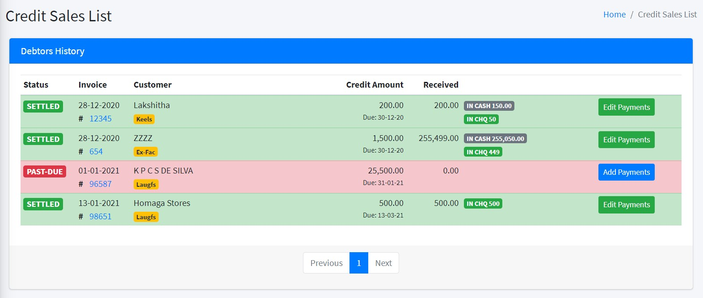
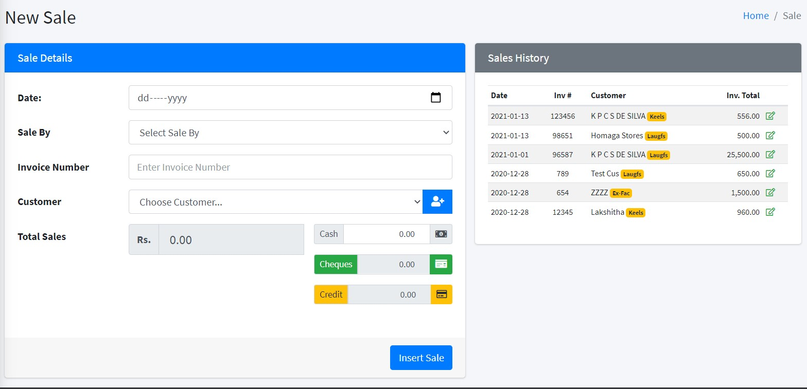
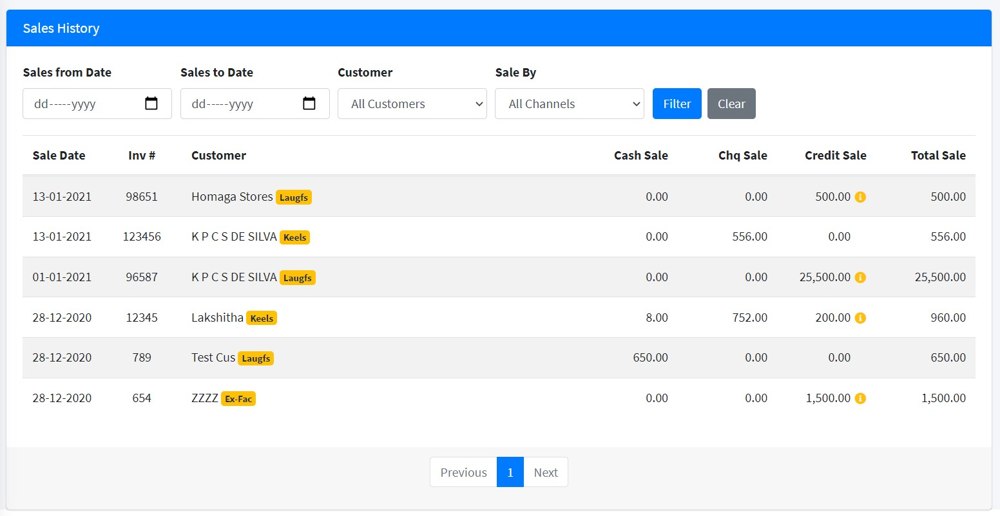

# Yellow Book

## (Sales and Financial recording and reporting application)

## Table of contents

- [General info](#introduction)
- [Screnshots](#screenshots)
- [Features](#features)
- [Technologies](#technologies)
- [Setup](#setup)

## Introduction

Note: This application is still under development. 80% Done
Todo: Dashboard Page, Purchases, Creditors, Expense register

Yellow Book is a tool custom built for a client who needed to record daily finance details of their company where the directors could see the performance and standing of the company on a daily basis without having to wait for the statements from the Accounts department.

## Screenshots

## Features

- Enter Daily sales with sales lead, mode of payment with cheque details
- Display creditors due for payment
- Insert details of collected credit with payment mode
- Enter daily expenses made from the petty cash
- Recorded deposits made to the bank from the cash in hand
- Record details of cash withdrawn from bank to reimburse petty cash
- Display cheques catogarising them according to their status (matured, in bank not realised, bounced, in hand)
- Reports: Sales Register, Debtors Register, Creditors Register, Cheques Register, Cash Register

## Technologies

- PHP
- JavaScript (ES6)
- CSS
- MySQL

## Setup

1. Host the files on a Server
2. Import sql file (db_yellowbook.sql) into database on server
3. access index.php on hosted folder root
